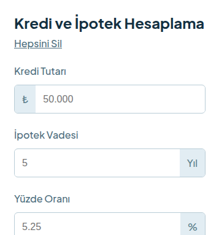

# React + Vite

This template provides a minimal setup to get React working in Vite with HMR and some ESLint rules.

Currently, two official plugins are available:

- [@vitejs/plugin-react](https://github.com/vitejs/vite-plugin-react/blob/main/packages/plugin-react) uses [Oxc](https://oxc.rs)
- [@vitejs/plugin-react-swc](https://github.com/vitejs/vite-plugin-react/blob/main/packages/plugin-react-swc) uses [SWC](https://swc.rs/)

## React Compiler

The React Compiler is not enabled on this template because of its impact on dev & build performances. To add it, see [this documentation](https://react.dev/learn/react-compiler/installation).

## Expanding the ESLint configuration

If you are developing a production application, we recommend using TypeScript with type-aware lint rules enabled. Check out the [TS template](https://github.com/vitejs/vite/tree/main/packages/create-vite/template-react-ts) for information on how to integrate TypeScript and [`typescript-eslint`](https://typescript-eslint.io) in your project.

# TR
# Kredi ve İpotek Hesaplayıcı
Aylık taksit ve toplam geri ödeme tutarını hesaplayan, "Geri Ödeme" ve "Sadece Faiz" modlarını destekleyen, React ile geliştirilmiş tam duyarlı bir ipotek hesaplama uygulaması.

## Canlı Önizleme

[Proje önizlemesi.](https://dursunkokturk.github.io/React-JS-Project-Loan-And-Mortgage-Calculator-App)

## Özellikler

- İki Hesaplama Modu — Anapara + faiz içeren "Geri Ödeme" ve yalnızca faiz hesaplayan "Sadece Faiz" modları
- Otomatik Yeniden Hesaplama — Faiz oranı veya vade değiştiğinde, butona tıklamadan sonuç otomatik güncellenir
- Alan Bazlı Doğrulama — Kredi tutarı, vade, faiz oranı ve kredi tipi için ayrı hata mesajları
- Aktif Prefix Vurgusu — Odaklanan alana göre "Yıl" ve "%" öneklerinin rengi değişir
- Hepsini Sil — Tek tıkla tüm form alanlarını ve sonuçları sıfırlar
- Koşullu Footer — Hesaplama yapılmadığında bilgi ekranı, yapıldığında sonuç ekranı gösterilir
- Tam Duyarlı Tasarım — Mobil, tablet ve masaüstü için üç ayrı düzen

## Duyarlı Düzenler

| Ekran    | Genişlik         | Düzen                                                           |
| -------- |------------------| ----------------------------------------------------------------|
| Mobil    | 375px Varsayılan | Tek sütun, dikey akış                                           |
| Tablet   | ≥ 768px          | 688px kart, header flex, vade ve faiz yan yana                  |
| Masaüstü | ≥ 1110px         | İki sütunlu: sol form, sağ footer; footer sol alt köşe yuvarlak |

## Teknolojiler

| Teknoloji  | Açıklama                                           |
| ---------- |----------------------------------------------------|
| React 18   | Bileşen yapısı ve state yönetimi                   |
| CSS3       | Flexbox, @media sorguları                          |
| JavaScript | İpotek formülleri, useEffect ile reaktif hesaplama |

## Proje Yapısı
src/  
├── App.jsx        # Tüm uygulama mantığı ve arayüz  
├── App.css        # Global stiller  
└── assets/  
    └── img/  
        ├── calculator.png        # Hesapla butonu ikonu  
        └── calculate-footer.png  # Boş footer görseli  

## Kurulum
bash# Repoyu klonlayın  
git clone https://github.com/dursunkokturk/React-JS-Project-Loan-And-Mortgage-Calculator-App.git

### Proje klasörüne girin
cd mortgage-calculator

### Bağımlılıkları yükleyin
npm install

### Geliştirme sunucusunu başlatın
npm run dev  
Tarayıcınızda http://localhost:5173 adresini açın.

## Hesaplama Formülleri

|                                                                                  | 
| -------------------------------------------------------------------------------- |
| Geri Ödeme (Anapara + Faiz):                                                     |
| Aylık Taksit = (P × r × (1 + r)^n) / ((1 + r)^n − 1)                             |
| Sadece Faiz:                                                                     |
| Aylık Taksit = P × r                                                             |
| P = Anapara, r = Aylık faiz oranı (yıllık oran / 12 / 100), n = Toplam ay sayısı |
| Toplam ödeme tutarı: Aylık Taksit × n                                            |

## Tasarım Detayları

- Renk Paleti:

  - #D8DB2F — Sarı-yeşil vurgu (buton, aktif radio, aktif prefix)
  - #133041 — Koyu lacivert (başlıklar, footer arka planı)
  - #031e2e — Çok koyu (sonuç kartı arka planı)
  - #9ABED5 — Açık mavi (footer metin)
  - #d73328 — Kırmızı (hata mesajları)
  - #E4F4FD — Açık mavi (tablet/masaüstü body arka planı)

- Font: Plus Jakarta Sans
- Masaüstü Footer Köşesi: Sol alt köşe border-radius: 80px ile oval

# EN
# Loan and Mortgage Calculator

A fully responsive mortgage calculator built with React, supporting "Repayment" and "Interest Only" modes to calculate monthly installments and total repayment amounts.

## Live Preview

[Project preview.](https://dursunkokturk.github.io/React-JS-Project-Loan-And-Mortgage-Calculator-App)

## Features

- Two Calculation Modes — "Repayment" mode including principal + interest, and "Interest Only" mode calculating interest alone
- Auto Recalculation — Results update automatically when the interest rate or term changes, without clicking a button
- Field-Level Validation — Separate error messages for loan amount, term, interest rate, and loan type
- Active Prefix Highlight — The color of "Years" and "%" prefixes changes based on the focused field
- Clear All — Resets all form fields and results with a single click
- Conditional Footer — Shows an info screen when no calculation has been made, and a results screen when one has
- Fully Responsive Design — Three separate layouts for mobile, tablet, and desktop

## Responsive Layouts

| Screen  | Width         | Layout                                                                 |
| ------- |---------------| -----------------------------------------------------------------------|
| Mobile  | 375px Default | Single column, vertical flow                                           |
| Tablet  | ≥ 768px       | 688px card, header flex, term and rate side by side                    |
| Desktop | ≥ 1110px      | Two-column: left form, right footer; footer bottom-left corner rounded |

## Technologies

| Technology | Description                                            |
| ---------- |--------------------------------------------------------|
| React 18   | Component structure and state management               |
| CSS3       | Flexbox, @media queries                                |
| JavaScript | Mortgage formulas, reactive calculation with useEffect |

## Project Structure

src/  
├── App.jsx        # All application logic and UI  
├── App.css        # Global styles  
└── assets/  
    └── img/  
        ├── calculator.png        # Calculate button icon  
        └── calculate-footer.png  # Empty footer image  

## Installation
bash

### Clone the repo
git clone https://github.com/dursunkokturk/React-JS-Project-Loan-And-Mortgage-Calculator-App.git

### Navigate to the project folder
cd mortgage-calculator

### Install dependencies
npm install

### Start the development server
npm run dev  

Open http://localhost:5173 in your browser.

## Calculation Formulas

|                                                                                               | 
| --------------------------------------------------------------------------------------------- |
| Repayment (Principal + Interest):                                                             |
| Monthly Payment = (P × r × (1 + r)^n) / ((1 + r)^n − 1)                                       |
| Interest Only:                                                                                |
| Monthly Payment = P × r                                                                       |
| P = Principal, r = Monthly interest rate (annual rate / 12 / 100), n = Total number of months |
| Total repayment amount: Monthly Payment × n                                                   |

## Design Details

- Color Palette:
    - #D8DB2F — Yellow-green accent (button, active radio, active prefix)
    - #133041 — Dark navy (headings, footer background)
    - #031e2e — Very dark (results card background)
    - #9ABED5 — Light blue (footer text)
    - #d73328 — Red (error messages)
    - #E4F4FD — Light blue (tablet/desktop body background)
- Font: Plus Jakarta Sans
- Desktop Footer Corner: Bottom-left corner oval with border-radius: 80px
